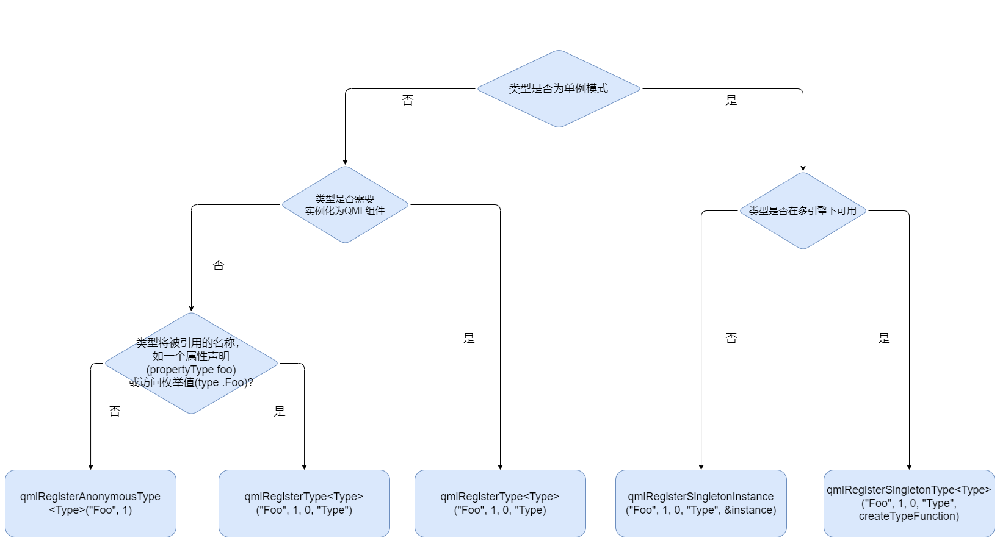

## 学习

[Qt进阶之路-目录](https://zhuanlan.zhihu.com/p/345452320) TaoQuick作者的教程[TaoQuick](https://github.com/jaredtao/TaoQuick)

[FluentUI](https://github.com/zhuzichu520/FluentUI)

## 杂项

### 信号

[qml 信号和处理程序事件系统](https://liucjy.blog.csdn.net/article/details/125563200)

### ListModel不支持传递数组的办法

QML：ListElement: cannot use script for property value

https://blog.csdn.net/u011942101/article/details/124219566


### Qml页面之间传值以及返回值

https://blog.csdn.net/happyrabbit456/article/details/56670809


### 页面切换

https://blog.csdn.net/zhuowalun8427/article/details/135401796

https://blog.csdn.net/xiaopei_yan/article/details/115767617


### QML多线程

[QML多线程](https://blog.csdn.net/qq_21438461/article/details/130417683)


### QML http

[QML调用HTTP](http://qthello.com/index.php/2024/04/25/qmlhttp/)

[Qt发送和解析JSON数据（通过使用qml调用js来post请求）](https://fanxinglanyu.blog.csdn.net/article/details/108331541)


自定义控件样式

可以在帮助文档搜索[Customizing Qt Quick Controls](C:\0_Akira\0_Work\3_env\Qt5.15.2\Docs\Qt-5.15.2\qtquickcontrols\qtquickcontrols2-customize.html)

## QT属性系统

[Q_PROPERTY](https://blog.csdn.net/gongjianbo1992/article/details/105243829)


## QML基本类型

var 可以接收任何类型，甚至是对象。当var接收对象时候需要使用JSON.stringify(var)函数转换

alisa 给一个属性起别名

## QML组件结构

[打造卓越 QML 层级设计：从入门到精通](https://liucjy.blog.csdn.net/article/details/130442696)

[qml的文件结构及其对象基本属性](https://liucjy.blog.csdn.net/article/details/125430230)

1. id
2. property declarations
3. signal declarations
4. JavaScript functions
5. object properties
6. child objects
7. states
8. transitions
9. onFoo

~~~javascript
Rectangle {
    id : btn+FunctionName
    
    property string a
    
    signal click()
    
    function add(a, b) {
        return a+b
    }
    
    width:
    heigth:
    anchors {
        left: ; leftMargin:
        top:  ; topMargin:
    }
    
    text:
    font {
        family :
        pixelSize:
    }
    
    Button {
        
    }
	
    onWidthChange: {
        click()
    }
}
~~~


## QML属性

### 基本属性

[qml使用数组技巧](https://www.cnblogs.com/chenchao521/articles/15493193.html)

[将二维数组从 C++ 传递到 qml](https://www.coder.work/article/3300175)

[property](https://liucjy.blog.csdn.net/article/details/125431820)

[var](https://liucjy.blog.csdn.net/article/details/125554802)

### 属性绑定

#### QML表达式

属性:变量值 

通过分号将属性和变量值进行绑定，当变量值改变时，属性的值也会改变 

#### Qt.binding() js绑定

Component.onCompleted: {

​	属性 = Qt.binding(function() { return 值};);

​	// 下面是单纯的赋值

​	属性 = 值

}

#### Binding组件

Binding {

​	target: id

​	property: 属性

​	value: 值

}

Binding的有一个when属性，可以实现条件绑定。（当然你在:绑定中写表达式同样可以做到）

### 附加属性

简单来说就是把一些属性或信号之类，附加到其他控件上

最典型的属性

ListView的index会附加到它的delegates上

最典型的附加信号

Component的completed信号会附加到它的父组件上

## QML布局

### xyz

z：越大在越上层

xy：相对于父组件的坐标轴（未验证）

### anchors

[anchors锚点](https://blog.csdn.net/qq_45792080/article/details/109301561)


anchors.horizontalCenter: parent.horizontalCenter

水平居中，需要配合anchor.top/bottom使用

垂直同理


### Row/Column/Grid

布局中的anchors属性会有限制

Row只能设置top和bottom（可以同时设置两个属性控制高度）

Colunm只能设置left和right


Grid网格布局：多了columns和row等属性，可以控制摆放组件的数量，顺序。和内部组件的宽高会有影响，错误的设置会导致显示错误


### Row/Colunm/GridLayout

[Row和RowLayout的差异](https://blog.csdn.net/sxczzZ/article/details/130555314)

Layout布局有很多附加属性，对布局的自由度更高

### StackLayout

栈布局

可以用作页面切换, stackLayout内的组件是已经创建好的

~~~javascript
Row {
    id: header
    Button {
        text: "home"
       	onClick: { layout.currentItem = 0 }
    }
    Button {
        text: "help"
        onClick: { layout.currentItem = 1 }
    }
}

StackLayout {
    id: layout
    anchors {
        top: header.bottom
        bottom: parent.bottom
        left: parent.left
        right: parent.right
    }
    
    currentItem: 0
    Rectangle {
        color: 'teal'
    }
    Rectangle {
        color: 'plum'
    }
    
    // 上面的封装
}
~~~


forEach

~~~javascript
let menus = ['Home', 'Help']
menus.forEach(function(item, index) {
    //这里的item和index分别是menus的序号和文本内容
})
~~~


### Flow

流式布局

## QML控件

### 可视控件

#### Rectangle

> 这个世界就是一个巨大的Rectangle --- qml


自定义圆角的控件（安卓下不可用）

~~~c++
// CurvedRectangle.qml
import QtQuick 2.12
import QtQuick.Controls 2.15
import QtQuick.Shapes 1.15

Shape {
    id: shape
    property var cornersRadius
    property color color
    property color borderColor:"transparent"
    property int borderWidth: 1
    layer.enabled: true
    layer.samples: 4
    layer.smooth: true


    ShapePath {
        startX: 0
        startY: cornersRadius[0]
        fillColor: color
        strokeColor: borderColor
        strokeWidth: borderWidth
        PathQuad { x: cornersRadius[0]; y: 0; controlX: 0; controlY: 0 }
        PathLine { x: shape.width - cornersRadius[1]; y: 0 }
        PathQuad { x: shape.width; y: cornersRadius[1]; controlX: shape.width; controlY: 0 }
        PathLine { x: shape.width; y: shape.height - cornersRadius[2] }
        PathQuad { x: shape.width - cornersRadius[2]; y: shape.height; controlX: shape.width; controlY: shape.height }
        PathLine { x: cornersRadius[3]; y: shape.height }
        PathQuad { x: 0; y: shape.height - cornersRadius[3]; controlX: 0; controlY: shape.height }
        PathLine { x: 0; y: cornersRadius[0] }
    }
} 

//main.qml Usage
CurvedRectangle {
     width: 80
     height: 80
     color: "cyan"
     cornersRadius: [20,0,20,0]
     borderWidth:1
     borderColor:"grey"
}
~~~


#### Label

#### Text

wrapMode: 设置文本的换行属性

elide: 设置文本溢出的省略显示格式

两个一起用的时候会发生冲突：解决方法，把Text放进一个具设置width和height的属性里面如：Item

```
设置字体居中
horizontalAlignment: Text.AlignHCenter
verticalAlignment: Text.AlignVCenter
```

[文本的横向与纵向包装](https://www.cnblogs.com/sammy621/p/16381994.html)


带范围的可滑动Text

~~~c++
    Rectangle {
        width: 200
        height: 100
        y: 100
        Item {
            anchors.fill: parent
            Flickable {
                width: parent.width
                height: parent.height
                contentWidth: width
                contentHeight: text_info.height
                ScrollBar.vertical: ScrollBar {}
                clip: true
                Text {
                    id: text_info
                    width: parent.width
                    wrapMode: Text.WrapAnywhere
                    padding: 14
                    text:"很长的文字"
                }
            }
        }
    }
~~~


#### TextArea


readOnly: 设置只读


TextArea 结合 ScrollView实现带滚动条的文本区域

~~~c++
ScrollView {
    id: info
    visible: true

    height: parent.height * 0.30
    anchors {
         left: parent.left
         right: parent.right
         bottom: parent.bottom
         margins: 10
     }
    // 限制只能垂直滑动
    contentWidth: availableWidth
    padding: 10

    background: Rectangle {
                radius: 6
                    color: '#282829'
            }

    clip: true

        TextArea {
        	color: "white"
        	wrapMode: Text.Wrap
        	readOnly: true
            text: "QML是一种描述性的脚本语言，文件格式以.qml结尾。语法格式非常像CSS（参考后文具体例子），但又支持javascript形式的编程控制。QtDesigner可以设计出ui界面文件，但是不支持和Qt原生C++代码的交互。QtScript可以和Qt原生代码进行交互，但是有一个缺点，如果要在脚本中创建一个继承于QObject的图形对象非常不方便，只能在Qt代码中创建图形对象，然后从QtScript中进行访问。而QML可以在脚本里创建图形对象，并且支持各种图形特效，以及状态机等，同时又能跟Qt写的C++代码进行方便的交互，使用起来非常方便。"
    }
}

~~~

详情看下面的连接


#### TextInput...

[QML 基本文本输入组件](https://blog.csdn.net/gongjianbo1992/article/details/101156110)

[Textinput](https://www.cnblogs.com/linuxAndMcu/p/13564090.html)

!! TextInput 没有这个属性placeholderText: "提示词"


#### Button

[按钮](https://blog.csdn.net/kenfan1647/article/details/122361622)

#### RadioButton

单选按钮


#### ProgressBar

进度条


#### Slider

滑块

#### ComboBox

下拉框

#### CheckBox

检查按钮

#### Spinbox

微调框

#### Switch

开关

#### TextArea

文本区域输入

#### TextField

单行文本输入

#### Image

fillMode设置填充模式


实现圆角图片 Qt5.15.2

~~~json
MouseArea
{
    width: 150
    height: 150
        
    Image {
    id: img
    anchors.fill: parent
    source: url
    visible: false
    }
    Rectangle {
        id: mask
        anchors.fill :parent
        radius: 8
        visible: false
    }
    OpacityMask {
        anchors.fill :parent
        source: img
        maskSource: mask
    }
}
~~~

[Image解析](https://developer.aliyun.com/article/1464148)

#### Calender

日历控件

### 非可视控件

#### MouseArea

鼠标区域支持


clicked(MouseEvent **mouse**), 我们可以通过**mouse**拿到点击的坐标或左键还是右键触发


propagateComposedEvents 事件穿透

可以将子对象的触发传递到父对象上

~~~javascript
Rectangle {
     color: "yellow"
     width: 100; height: 100

     MouseArea {
         anchors.fill: parent
         onClicked: console.log("clicked yellow")
     }

     Rectangle {
         color: "blue"
         width: 50; height: 50

         MouseArea {
             anchors.fill: parent
             propagateComposedEvents: true		// 穿透设为true
             onClicked: {
                 console.log("clicked blue")
                 mouse.accepted = false 		// 在处理完子组件的事件后将accepted设为false
             }
         }
     }
 }
~~~


drag.target: parent为父对象添加拖拽支持。（设置父anchors属性会影响拖拽的效果，xy则不会）

#### Keys

按键支持

#### Timer

定时器

interval: 毫秒  运行的毫秒数

repeat: bool   是否重复

running: bool  是否运行

triggeredOnStart: bool 创建完成立马运行一次

~~~javascript
// 用Timer显示当前时间
Label {
    
    Timer {e
        interval: 1000
        repeat: true
        running : true
        triggeredOnStart: true
        
        onTriggered: {
            parent.setDate(Qt.formateDateTime(new Date(), 'yyyy-MM-dd hh:mm:ss'))
        }
        
        function setDate(dateString) {
            text = dateString
        }
    }
}
~~~


#### Loader

加载器

**Properties**

source: url	//没法传参

sourceComponent: Component	//可以传参

~~~c++
Loader{
    anchors.centerIn: parent
    sourceComponent: Component {
    	Label {
        	参数
        }
    }
}
~~~


**Methods**

setSource(url, properties)

[QML类型：Loader](https://blog.csdn.net/kenfan1647/article/details/125401180)

#### Component

Component.onCompleted:{} // 相当于组件的构造函数

Component.onDestruction:{} // 相当于组件的析构函数


Component只能作为一个组件的父类，想要多组件需要用一个Item等组件包裹

Component不能声明属性，可以声明在子组件内


creatObject(parent, properties)方法，parent为父类，properties为参数


使用Component包裹控件，可以达到复用的效果

~~~javascript
//使用Component多次创建对象
Component {
	id: dateTimeLabel
	Label {
		// 同Timer一致
	}
}

Column {
	Component.onCompleted: {
		setDateTimeLabel(10)
	}
	
	function setDateTimeLabel(num) {
		for (let i =0; i < num; ++i)
            dateTimeLabel.createObject(this)
	}
}
~~~


JS创建对象`Qt.createComponent`(url, mode, parent)

​	url: 加载的组件url

​	mode: 选择加载模式，默认为Component.PreferSynchronous同步加载，Component.Asynchronous为异步加载

​	parent: 加载到哪个父组件

```javascript
let cmp = Qt.createComponent(url, mode, parent) //创建对象
if (cmp.status === Component.Ready) {
    cmp.createObject() //加载对象
}
```


#### DropArea

拖放支持

#### Drag

拖支持

#### Connections

信号处理组件

#### WorkerScript

允许js代码允许在独立线程


#### Repeater

重复器创建出来的对象的父类是重复器的父类，也就是说重复器本身不能做父类

### Window


### ApplicationWindow


### TabBar&TabButton

[](https://blog.csdn.net/gongjianbo1992/article/details/102648351)


TabBar + SwipeView实现页面切换

[自定义TabBar样式](https://blog.csdn.net/gongjianbo1992/article/details/102648351)

currentIndex可以拿到当前TabButton


### TabButton

import QtQuick.Controls.impl 2.12

contentItem : `IconLabel` {


}

可以修改TabButton默认的内部控件


### VideoOutput

### MediaPlayer


### BusyIndicator

一个等待加载的控件


### GridView


### ListView

[树形ListView](https://blog.csdn.net/luoyayun361/article/details/81585101)


嵌套ListView


[QML ListView几个常用且非常重要的属性](https://luoyayun361.blog.csdn.net/article/details/83373805)


[ListView性能优化](https://blog.csdn.net/weixin_36026097/article/details/134851727)


#### model 

当model为list数组的形式时候，添加model

~~~javascript
ListView {
    id: listView
    model : ['Apple', 'Banana']
    
    Component.onCompleted: {
        let modelArray = listView.model
        modelArray.push("Coconut")
        listView.model = modelArray
    }
}
~~~

[Qml组件化编程9-Model和View](https://zhuanlan.zhihu.com/p/66928607)

#### ListModel

当model为ListModel的形式时候，添加model

~~~javascript
ListView {
    id: listView
    model : ListModel {
        id: listModel
        ListElement {
            name: 'Apple'
            cnt: "10"
        }
        ListElement {
            name: 'Banana'
            cnt: "8"
        }
    }
    
    Component.onCompleted: {
        listModel.append({'name':'coconut', 'cnt':'6'})
    }
}
~~~


section分类器

section.property:

section.delegate:

用法看文档即可


section的一些问题：

1. model必须使用ListModel
2. 想要完美归类必须手动排序ListModel的分类属性
3. height必须设置为常数数值，不然会丢数据


附加属性

delegate的子类如果想要拿到ListView的附加属性必须指定父对象（即delegate本身），比如

~~~javascript
ListView {

	delegate: Rectangle {
		width: parent.width
        height: 10
        color: ListView.isCurrentItem ? "blue": "black"
        
        Text {
        	anchors.centerIn: parent
            text : "xx"
            font.bold: parent.ListView.isCurrentItem
        }
	}
}
~~~


footer

header


orientation: Qt.Horizontal设置ListView横向排列


### StackView

stackView的管理的页面和stackView本身的大小一致

initialItem 初始页

push()入栈

pop()出栈

当压入为url或者Component时，入栈时会创建，出栈时会销毁。（Item入栈文档没说，待验证）


被压入的组件不能有required关键字，否则会出现问题


### SwipeView

取消滑动过度动画

interactive: false

Component.onCompleted: {

​	contentItem.highlightMoveDuration = 0

}


~~~javascript
Item {
    id: root
    anchors.fill: parent
    property var pages: ['home','about','help']
    
    TabBar {
        id: tabBar
        anchors {
            left: root.left
            right: root.right
        }
        
        currentIndex: swipeVide.currentIndex
        
        Repeater {
            model: root.pages
            TabButton {
                text: modelData
                onClicked: swipeVide.currentIndex = index
            }
        }
    }
    
    SwipeView {
        id: swipeVide
        anchors {
            top: tabBar.bottom
            bottom: root.bottom
            left: root.left
            right: root.right
        }
        
        Repeater {
            model: root.pages.length
            Rectangle {
                color: randomColor() //自定义JS函数
            }
        }
    }
}
~~~


### Flickable

[](https://blog.csdn.net/kenfan1647/article/details/120662308)


// 禁止弹出或拖动出边界

boundsMovement: Flickable.StopAtBounds


### State

状态，通过State可以改变组件的属性

~~~javascript
 Rectangle {
     id: myRect
     width: 100; height: 100
     color: "black"

     MouseArea {
         id: mouseArea
         anchors.fill: parent
         // 第一种触发方式
         // onClicked: myRect.state == 'clicked' ? myRect.state = "" : myRect.state = 'clicked';
     }

     states: [
         State {
             name: "clicked"
         	 // 第二种触发方式
         	 // when: mouseArea.pressed
             PropertyChanges { target: myRect; color: "red" }
         }
     ]
 }
~~~


状态机

~~~javascript
SwipeView {
	id: view
    anchors {
        top: parent.top
        bottom: btn.top
        left: parent.left
        right: parent.right
    }
    
    Repeate {
        model: 3
        Rectangle {
           
        }
    }
}

PageIndicator {
    anchors {
        bottom: view.bottom
        horizontalCenter: view.horizontalCenter
    }
    count: view.count
    currentIndex: view.currentIndex
}

Button {
    id: btn
    anchors {
        bottom: parent.bottom
    	horizontalCenter: view.horizontalCenter
    }
    
    states: [
        State {
        	when: view.currentIndex === 0
        	PropertyChanges {
        		target: btn
        		text: 'home'
        		onClicked: {
        			console.log('home')
        		}
        	}
        },
        State {
        	when: view.currentIndex === 1
        	PropertyChanges {
        		target: btn
        		text: 'Help'
        		onClicked: {
        			console.log('Help')
        		}
        	}
        },
        State {
        	when: view.currentIndex === 2
        	PropertyChanges {
        		target: btn
        		text: 'About'
        		onClicked: {
        			console.log('About')
        		}
        	}
        }
    ]
}
~~~


### Behavior

Behavior 定义了每当特定属性值更改时要应用的默认动画。

~~~javascript
import QtQuick 2.0

Rectangle
{
    id: rect
    width: 100; height: 100
    color: "red"

    Behavior on width
    {
        NumberAnimation { duration: 1000 }
    }

    MouseArea
    {
        anchors.fill: parent
        onClicked: rect.width = 50
    }
}
~~~


### Transition

[Behavior、Transition、State介绍](https://zhuanlan.zhihu.com/p/642946997)

[QML教程](https://www.bilibili.com/video/BV1Ay4y1W7xd?p=57&spm_id_from=pageDriver&vd_source=44662999a7a2a4af9aa775c365e24432)

### Animation

SequentialAnimation 顺序动画：按顺序执行

ParallelAnimation   并行动画：同时执行

PropertyAnimation   属性动画，子类有NumberAnimation、ColorAnimation等


[QML动画实战指南：打造华丽且高性能的用户界面动效](https://liucjy.blog.csdn.net/article/details/130318876)

### Dialog

对话框 

QtQuick.Dialogs 1.3 老版本的对话框

通过设置contentItem来改变内容


### Drawer

[抽屉控件](https://www.bilibili.com/video/BV1gy411a716/)

[QML控件类型：Drawer](https://blog.csdn.net/kenfan1647/article/details/125370551)

### Popup

[QML控件类型：Popup](https://blog.csdn.net/kenfan1647/article/details/122816454)

## 信号和槽

信号 signal 函数名()

函数名() 发出信号


Connection {

​	target: 拥有信号的组件id

​	function on函数名() {

​		// 编写槽函数

​	}

}


## QML结合Cpp




如果希望Cpp类型拥有Item的性质，继承QQuickItem

如果希望Cpp类型处理数据，继承QObject


### QML和C++之间的数据类型转换

[QML和C++之间的数据类型转换](https://blog.csdn.net/kenfan1647/article/details/121324037)


QByteArray 到 JavaScript ArrayBuffer

QML 引擎提供 QByteArray 值和 [JavaScript ArrayBuffer](https://www.cnblogs.com/copperhaze/p/6149041.html) 对象之间的自动类型转换。


### Cpp调用QML

~~~c++
// main.qml
import QtQuick 2.12
import QtQuick.Controls 2.12
import QtQuick.Window 2.12

Window {
    visible: true
    width: 640
    height: 480
    title: qsTr("Hello World")

    Label {
        objectName: "cppLabel"

        text: "QML & CPP"

        function getText(info) {
            return text + info
        }
    }
}

// main.cpp
#include <QGuiApplication>
#include <QQmlApplicationEngine>
#include <QMetaObject>

int main(int argc, char *argv[])
{
    QCoreApplication::setAttribute(Qt::AA_EnableHighDpiScaling);

    QGuiApplication app(argc, argv);

    QQmlApplicationEngine engine;
    const QUrl url(QStringLiteral("qrc:/main.qml"));

    engine.load(url);

    // 拿到qml的根对象，即Window
    QObject* root = engine.rootObjects().first();
    // 通过qml设置的objectName拿到label组件
    QObject* label = root->findChild<QObject*>("cppLabel");

    // 设置label组件的属性
    label->setProperty("text", "Hello");
    // 调用label组件的函数
    QVariant ret;   // 用来接收函数的返回值
    // invokeMethod(被调用的对象，函数的名称，返回值，参数(没有可忽略))
    QMetaObject::invokeMethod(label, "getText", Q_RETURN_ARG(QVariant, ret), Q_ARG(QVariant, " world"));

    qDebug() << ret.toString();
    return app.exec();
}
~~~


### QML调用CPP

#### 注册实例的两种方法

~~~c++
//person.h
#ifndef PERSON_H
#define PERSON_H

#include <QObject>

class person : public QObject
{
    Q_OBJECT
public:
    explicit person(QObject *parent = nullptr);
    person(QString name, quint32 age) noexcept;

    Q_INVOKABLE void printInfo() const noexcept; // 被qml调用的函数需要添加Q_INVOKABLE关键字
private:
    QString _name;
    quint32 _age;
signals:

};

#endif // PERSON_H


// main 
#include <QGuiApplication>
#include <QQmlApplicationEngine>
#include <QMetaObject>
#include <QQmlContext>

#include "./person.h"

int main(int argc, char *argv[])
{
    QCoreApplication::setAttribute(Qt::AA_EnableHighDpiScaling);

    QGuiApplication app(argc, argv);

    QQmlApplicationEngine engine;
    const QUrl url(QStringLiteral("qrc:/main.qml"));

    // 方法一：注册函数，必须写在load的前面
    //person person("Akira", 18);
    //qmlRegisterSingletonInstance("MyModel", 1, 0, "Person" ,&person);
    
    // 方法二：上下文注册,需要添加头文件<QQmlContext>
    person person("Akira", 18);
    QQmlContext* ctx = engine.rootContext();
    ctx->setContextProperty("Person", &person);
    
    engine.load(url);
    
    return app.exec();
}

// main.qml
import QtQuick 2.12
import QtQuick.Controls 2.12
import QtQuick.Window 2.12
//import MyModel 1.0	// 方法一需要导入

Window {
    visible: true
    width: 640
    height: 480
    title: qsTr("Hello World")
	
    Button {
        text: 'click'
        onClicked: {
            // 方法一和方法二调用方式一样
            Person.printInfo()
        }
    }
}

~~~


### Cpp捕捉QML信号

~~~c++
// person.h
#ifndef PERSON_H
#define PERSON_H

#include <QObject>

class person : public QObject
{
    Q_OBJECT
public:
    explicit person(QObject *parent = nullptr);
    person(QString name, quint32 age) noexcept;

public slots: // 两个用于接收信号的槽函数
    void clickDemo() const noexcept;
    void clickTimesTen(int count) const noexcept;
private:
    QString _name;
    quint32 _age;
signals:

};

#endif // PERSON_H


// main.cpp
#include <QGuiApplication>
#include <QQmlApplicationEngine>
#include <QMetaObject>
#include <QQmlContext>

#include "./person.h"

int main(int argc, char *argv[])
{
    QCoreApplication::setAttribute(Qt::AA_EnableHighDpiScaling);

    QGuiApplication app(argc, argv);

    QQmlApplicationEngine engine;
    const QUrl url(QStringLiteral("qrc:/main.qml"));

    // 首先注册实例
    person person("Akira", 18);
    QQmlContext* ctx = engine.rootContext();
	ctx->setContextProperty("Person", &person);
    
    engine.load(url);

    // 其次拿到qml的根对象，即Window
    QObject* root = engine.rootObjects().first();
    // 通过qml设置的objectName拿到Button组件
    QObject* Button = root->findChild<QObject*>("cppButton");
    // 连接qml信号和cpp槽函数
    QObject::connect(Button, SIGNAL(clicked()), &person, SLOT(clickDemo()));
    QObject::connect(Button, SIGNAL(countDemo(int)), &person, SLOT(clickTimesTen(int)));

    return app.exec();
}

// main.qml
import QtQuick 2.12
import QtQuick.Controls 2.12
import QtQuick.Window 2.12

Window {
    visible: true
    width: 640
    height: 480
    title: qsTr("Hello World")

    Button {
        objectName: "cppButton"
        text: 'click'

        property int count: 0
        // 自定义信号countDemo
        signal countDemo(int cnt);
	
        // 组件自带的Clicked信号
        onClicked: {
            ++count;
            if (count %10 === 0)
                countDemo(count)
        }
    }
}
~~~


### QML捕捉Cpp信号

~~~c++
//person.h
#ifndef PERSON_H
#define PERSON_H

#include <QObject>

class person : public QObject
{
    Q_OBJECT
public:
    explicit person(QObject *parent = nullptr);
    person(QString name, quint32 age) noexcept;

    Q_INVOKABLE void printInfo() const noexcept; // 被qml调用的函数需要添加Q_INVOKABLE关键字
private:
    QString _name;
    quint32 _age;
signals:
    void qmlCall(QString) const;
};

#endif // PERSON_H


// person.cpp
#include "person.h"
#include <QDebug>

person::person(QObject *parent) : QObject(parent) {}

person::person(QString name, quint32 age) noexcept : _name(qMove(name)), _age(age) {}

void person::printInfo() const noexcept
{
    QString string = QString("name %1 age %2").arg(_name).arg(_age);
    qDebug() << string;
    emit qmlCall(string);	// 发送qmlCall信号
}

// main.cpp
#include <QGuiApplication>
#include <QQmlApplicationEngine>
#include <QMetaObject>
#include <QQmlContext>

#include "./person.h"

int main(int argc, char *argv[])
{
    QCoreApplication::setAttribute(Qt::AA_EnableHighDpiScaling);

    QGuiApplication app(argc, argv);

    QQmlApplicationEngine engine;
    const QUrl url(QStringLiteral("qrc:/main.qml"));

    person person("Akira", 18);
    QQmlContext* ctx = engine.rootContext();
    ctx->setContextProperty("Person", &person);
    
    engine.load(url);

    return app.exec();
}


// main.qml
import QtQuick 2.12
import QtQuick.Controls 2.12
import QtQuick.Window 2.12

Window {
    visible: true
    width: 640
    height: 480
    title: qsTr("Hello World")

    Button {
        objectName: "cppButton"
        text: 'click'

        onClicked: {
            Person.printInfo()	// 点击按钮->调用Person的函数，函数发送qmlCall信号
        }
    }
	
    // 接收qmlCall信号
    Connections {
        target: Person
        function onQmlCall(arg) {
            console.log("cpp signal", arg)
        }
    }
}
~~~


### 注册Cpp类型到QML

#### qmlRegisterType

~~~c++
// info.h	// info.cpp内将属性的信号添加set函数内
#ifndef INFO_H
#define INFO_H

#include <QObject>
#include <QDate>
class info : public QObject
{
    Q_OBJECT
public:
    explicit info(QObject *parent = nullptr);

    QString name() const;
    void setName(const QString &name);

    quint32 age() const;
    void setAge(const quint32 &age);

    QDate date() const;
    void setDate(const QDate &data);

private:
    // Alt+Enter快捷键生成setter&getter
    QString _name;Q
    quint32 _age;
    QDate _date;
	
    // 两种方法设置属性 MEMBER 和 READ&WRITE 还有其他关键字看文档
    Q_PROPERTY(QString name MEMBER _name NOTIFY nameChanged)
    Q_PROPERTY(qint32 age READ age WRITE setAge NOTIFY ageChanged)
    Q_PROPERTY(QDate date READ date WRITE setDate NOTIFY dateChanged)

signals:
    void nameChanged();
    void ageChanged();
    void dateChanged();
};

#endif // INFO_H


// main.cpp
#include <QGuiApplication>
#include <QQmlApplicationEngine>
#include <QMetaObject>
#include <QQmlContext>

#include "info.h"
int main(int argc, char *argv[])
{
    QCoreApplication::setAttribute(Qt::AA_EnableHighDpiScaling);

    QGuiApplication app(argc, argv);

    QQmlApplicationEngine engine;
    const QUrl url(QStringLiteral("qrc:/main.qml"));

    qmlRegisterType<info>("MyModel", 1, 0, "Info");

    engine.load(url);

    return app.exec();
}


// main.qml
import QtQuick 2.12
import QtQuick.Controls 2.12
import QtQuick.Window 2.12
import MyModel 1.0

Window {
    visible: true
    width: 640
    height: 480
    title: qsTr("Hello World")

    Button {
        text: 'click'

        onClicked: {
            console.log(info.name + " " + info.age + " " + Qt.formatDateTime(info.date, 'yyyy-MM-dd hh:mm:ss'))
            info.name = "banana"
        }
    }

    Info {
        id: info
        name: 'Akira'
        age: 18
        date: new Date()

        onNameChanged: {
            console.log("nameChanged -->", name)
        }
    }
}

~~~


#### qmlRegisterUncreatableType

用来创建附加属性 -- 更加严格的标准是 qmlRegisterAnonymousType

~~~c++
// info.h info.cpp和上面一样

// person.h
#ifndef PERSON_H
#define PERSON_H

#include <QObject>

#include <QtQml>
#include "info.h"

class person : public QObject
{
    Q_OBJECT

    QML_ATTACHED(info)	// 用来添加附加属性
public:
    explicit person(QObject *parent = nullptr);

    static info* qmlAttachedProperties(QObject*);	// 创建附加属性的对象
};

#endif // PERSON_H


// person.cpp
#include "person.h"

person::person(QObject *parent) : QObject(parent){}

info* person::qmlAttachedProperties(QObject* object)
{
    return new info(object);
}


// main.cpp
#include <QGuiApplication>
#include <QQmlApplicationEngine>
#include <QMetaObject>
#include <QQmlContext>

#include "person.h"
#include "info.h"
int main(int argc, char *argv[])
{
    QCoreApplication::setAttribute(Qt::AA_EnableHighDpiScaling);

    QGuiApplication app(argc, argv);


    QQmlApplicationEngine engine;
    const QUrl url(QStringLiteral("qrc:/main.qml"));
	
    // 注册附加属，最后一个参数是试图创建该对象返回的错误信息
    qmlRegisterUncreatableType<person>("MyModel", 1, 0 , "Person", "Bad instances are not allowed");

    engine.load(url);

    return app.exec();
}


// main.qml
import QtQuick 2.12
import QtQuick.Controls 2.12
import QtQuick.Window 2.12
import MyModel 1.0

Window {
    visible: true
    width: 640
    height: 480
    title: qsTr("Hello World")

    Button {
        objectName: "cppButton"
        text: 'click'

        Person.name: "Attached"
        Person.age: 20
        Person.date: new Date()

        onClicked: {
            console.log(Person.name + " " + Person.age+ " " +  Qt.formatDateTime(Person.date, 'yyyy-MM-dd'))
        }
    }
}

~~~


### Cpp封装自定义组件到QML

~~~c++
// 自定义组件battery.h
#ifndef BATTERY_H
#define BATTERY_H

#include <QObject>
#include <QQuickPaintedItem>

class battery : public QQuickPaintedItem
{
    Q_OBJECT

public:
    explicit battery(QQuickItem *parent = nullptr);

    // 重写绘制函数
    void paint(QPainter*) override;

    quint32 electric() const;
    void setElectric(quint32 value);

    QColor color() const;
    void setColor(QColor color);

    quint32 threshold() const;
    void setThreshold(quint32 value);

private:
    quint32 _lineWidth = 1;
    quint32 _electric = 70;
    QColor _color = Qt::green;
    QColor _warningColor = Qt::red;
    quint32 _threshold = 20;
	
    // 经过实测这里不能用MEMBER关键字，会导致update函数无法生效
    Q_PROPERTY(quint32 electric READ electric WRITE setElectric NOTIFY electricChanged)
    Q_PROPERTY(QColor color READ color WRITE setColor NOTIFY colorChanged)
    Q_PROPERTY(quint32 threshold READ threshold WRITE setThreshold NOTIFY thresholdChanged)
signals:
    void electricChanged();
    void colorChanged();
    void thresholdChanged();
};

#endif // BATTERY_H
~~~


~~~c++
// battery.cpp
#include "battery.h"
#include <QPen>
#include <QPainter>
#include <QBrush>

battery:: battery(QQuickItem *parent) : QQuickPaintedItem(parent)
{

}

quint32 battery::electric() const
{
    return _electric;
}

void battery::setElectric(quint32 value)
{
    if (value < 0 || value > 100)
        return;
    _electric = value;
    emit electricChanged();
    update();
}

QColor battery::color() const
{
    return _color;
}

void battery::setColor(QColor color)
{
    _color = color;
    emit colorChanged();
    update();
}

quint32 battery::threshold() const
{
    return _threshold;
}

void battery::setThreshold(quint32 value)
{
    if (value < 0 || value > 100)
        return;
    _threshold = value;
    emit thresholdChanged();
    update();
}

void battery::paint(QPainter* painter)
{
    QPen pen;
    pen.setColor(Qt::darkRed);
    pen.setWidth(_lineWidth);

    painter->setPen(pen);

    quint32 headWidth = width() * 0.1;
    quint32 headHeight = height() * 0.3;

    auto cellWidth = width() - pen.width() - headWidth;
    auto cellHeight = height() - pen.width();

    painter->drawRect(0, 0, cellWidth, cellHeight);

    auto electricWidth = (cellWidth - pen.width()) * _electric / 100;
    auto electricHeight = cellHeight - pen.width();
    painter->fillRect(pen.width(), pen.width(), electricWidth, electricHeight, _electric > _threshold ? _color : _warningColor);

    auto headX = cellWidth + pen.width();
    auto headY = height() / 2 - headHeight / 2;
    painter->fillRect(headX, headY, headWidth, headHeight, Qt::black);
}
~~~


~~~c++
// main.cpp
#include <QGuiApplication>
#include <QQmlApplicationEngine>
#include <QMetaObject>
#include <QQmlContext>

#include "battery.h"

int main(int argc, char *argv[])
{
    QCoreApplication::setAttribute(Qt::AA_EnableHighDpiScaling);

    QGuiApplication app(argc, argv);

    QQmlApplicationEngine engine;
    const QUrl url(QStringLiteral("qrc:/main.qml"));
	
    // 注册到qml
    qmlRegisterType<battery>("MyModel", 1, 0, "Battey");

    engine.load(url);
    
    return app.exec();
}

~~~


~~~c++
// main.qml

import QtQuick 2.12
import QtQuick.Controls 2.12
import QtQuick.Window 2.12
import MyModel 1.0

Window {
    visible: true
    width: 640
    height: 480
    title: qsTr("Hello World")

    Column {
        Battey {
            id: battey

            visible: true
            width: 100
            height: 40

            color: 'blue'
            threshold: 30
            electric: slider.value
            }
        }

        Slider {
            id: slider

            from: 0
            to: 100

            value: 30
            }
        }
    }
}

~~~


### 注册CppList到QML

https://www.bilibili.com/video/BV1Ay4y1W7xd/?p=68&spm_id_from=pageDriver&vd_source=44662999a7a2a4af9aa775c365e24432


### Cpp注册Model到QML

https://www.bilibili.com/video/BV1Ay4y1W7xd?p=69&vd_source=44662999a7a2a4af9aa775c365e24432